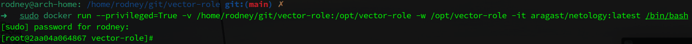
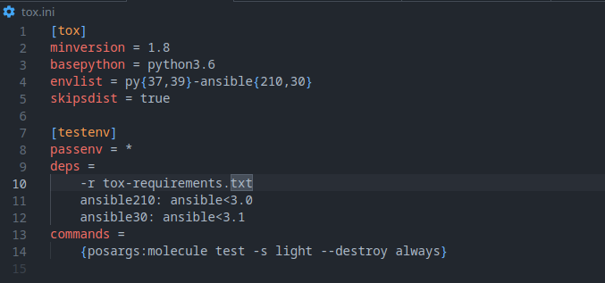

# Домашнее задание к занятию 5 «Тестирование Roles»

## Выполнил студент группы DevOps-25 Шаповалов Кирилл

<br />

Подготовка к выполнению
-----------------------

    1. Установите molecule: pip3 install "molecule==3.5.2" и драйвера pip3 install molecule_docker molecule_podman.

Для задания ставил `molecule latest`:


Как выяснилось, Molecule начиная с версии 5.0.0 не использует драйвера `molecule_docker` и `molecule_podman`, вместо них нужно использовать `pip3 install molecule-plugins[docker]`, как итог - получится нечто такое:


    2. Выполните docker pull aragast/netology:latest — это образ с podman, tox и несколькими пайтонами (3.7 и 3.9) внутри.

Выполнено:


<br />

Основная часть
--------------

<br />

**Ваша цель** — настроить тестирование ваших ролей.

**Задача** — сделать сценарии тестирования для vector.

**Ожидаемый результат** — все сценарии успешно проходят тестирование ролей.

<br />

## Molecule

<br />

    1. Запустите molecule test -s centos_7 внутри корневой директории clickhouse-role, 
    посмотрите на вывод команды. Данная команда может отработать с ошибками, это нормально. 
    Наша цель - посмотреть как другие в реальном мире используют молекулу.

Здесь и далее вывод команд буду предоставлять в виде кода, спрятанного под спойлер, так как скриншоты получились бы просто огромные.

<details><summary>Консоль</summary>

```bash
rodney@arch-home: /home/rodney/learning/netology/Netology/homeWork/9.5/playbook/roles/clickhouse git:(main) ✗ 
➜   sudo molecule test -s centos_7                   
WARNING  Driver docker does not provide a schema.
INFO     centos_7 scenario test matrix: dependency, cleanup, destroy, syntax, create, prepare, converge, idempotence, side_effect, verify, cleanup, destroy
INFO     Performing prerun with role_name_check=0...
INFO     Set ANSIBLE_LIBRARY=/root/.cache/ansible-compat/7e099f/modules:/root/.ansible/plugins/modules:/usr/share/ansible/plugins/modules
INFO     Set ANSIBLE_COLLECTIONS_PATH=/root/.cache/ansible-compat/7e099f/collections:/root/.ansible/collections:/usr/share/ansible/collections
INFO     Set ANSIBLE_ROLES_PATH=/root/.cache/ansible-compat/7e099f/roles:/root/.ansible/roles:/usr/share/ansible/roles:/etc/ansible/roles
INFO     Using /root/.cache/ansible-compat/7e099f/roles/alexeysetevoi.clickhouse symlink to current repository in order to enable Ansible to find the role using its expected full name.
INFO     Running centos_7 > dependency
WARNING  Skipping, missing the requirements file.
WARNING  Skipping, missing the requirements file.
INFO     Running centos_7 > cleanup
WARNING  Skipping, cleanup playbook not configured.
INFO     Running centos_7 > destroy
INFO     Sanity checks: 'docker'

PLAY [Destroy] *****************************************************************

TASK [Set async_dir for HOME env] **********************************************
ok: [localhost]

TASK [Destroy molecule instance(s)] ********************************************
changed: [localhost] => (item=centos_7)

TASK [Wait for instance(s) deletion to complete] *******************************
FAILED - RETRYING: [localhost]: Wait for instance(s) deletion to complete (300 retries left).
ok: [localhost] => (item=centos_7)

TASK [Delete docker networks(s)] ***********************************************
skipping: [localhost]

PLAY RECAP *********************************************************************
localhost                  : ok=3    changed=1    unreachable=0    failed=0    skipped=1    rescued=0    ignored=0

INFO     Running centos_7 > syntax

playbook: /home/rodney/learning/netology/Netology/homeWork/9.5/playbook/roles/clickhouse/molecule/resources/playbooks/converge.yml
INFO     Running centos_7 > create

PLAY [Create] ******************************************************************

TASK [Set async_dir for HOME env] **********************************************
ok: [localhost]

TASK [Log into a Docker registry] **********************************************
skipping: [localhost] => (item=None) 
skipping: [localhost]

TASK [Check presence of custom Dockerfiles] ************************************
ok: [localhost] => (item={'capabilities': ['SYS_ADMIN'], 'command': '/usr/sbin/init', 'dockerfile': '../resources/Dockerfile.j2', 'env': {'ANSIBLE_USER': 'ansible', 'DEPLOY_GROUP': 'deployer', 'SUDO_GROUP': 'wheel', 'container': 'docker'}, 'image': 'centos:7', 'name': 'centos_7', 'privileged': True, 'tmpfs': ['/run', '/tmp'], 'volumes': ['/sys/fs/cgroup:/sys/fs/cgroup']})

TASK [Create Dockerfiles from image names] *************************************
changed: [localhost] => (item={'capabilities': ['SYS_ADMIN'], 'command': '/usr/sbin/init', 'dockerfile': '../resources/Dockerfile.j2', 'env': {'ANSIBLE_USER': 'ansible', 'DEPLOY_GROUP': 'deployer', 'SUDO_GROUP': 'wheel', 'container': 'docker'}, 'image': 'centos:7', 'name': 'centos_7', 'privileged': True, 'tmpfs': ['/run', '/tmp'], 'volumes': ['/sys/fs/cgroup:/sys/fs/cgroup']})

TASK [Synchronization the context] *********************************************
failed: [localhost] (item={'capabilities': ['SYS_ADMIN'], 'command': '/usr/sbin/init', 'dockerfile': '../resources/Dockerfile.j2', 'env': {'ANSIBLE_USER': 'ansible', 'DEPLOY_GROUP': 'deployer', 'SUDO_GROUP': 'wheel', 'container': 'docker'}, 'image': 'centos:7', 'name': 'centos_7', 'privileged': True, 'tmpfs': ['/run', '/tmp'], 'volumes': ['/sys/fs/cgroup:/sys/fs/cgroup']}) => {"ansible_index_var": "i", "ansible_loop_var": "item", "changed": false, "i": 0, "item": {"capabilities": ["SYS_ADMIN"], "command": "/usr/sbin/init", "dockerfile": "../resources/Dockerfile.j2", "env": {"ANSIBLE_USER": "ansible", "DEPLOY_GROUP": "deployer", "SUDO_GROUP": "wheel", "container": "docker"}, "image": "centos:7", "name": "centos_7", "privileged": true, "tmpfs": ["/run", "/tmp"], "volumes": ["/sys/fs/cgroup:/sys/fs/cgroup"]}, "msg": "Failed to find required executable \"rsync\" in paths: /home/rodney/yandex-cloud/bin:/usr/local/sbin:/usr/local/bin:/usr/bin:/usr/bin/site_perl:/usr/bin/vendor_perl:/usr/bin/core_perl:/sbin:/usr/sbin"}

PLAY RECAP *********************************************************************
localhost                  : ok=3    changed=1    unreachable=0    failed=1    skipped=1    rescued=0    ignored=0

CRITICAL Ansible return code was 2, command was: ['ansible-playbook', '--inventory', '/root/.cache/molecule/clickhouse/centos_7/inventory', '--skip-tags', 'molecule-notest,notest', '/usr/lib/python3.11/site-packages/molecule_plugins/docker/playbooks/create.yml']
WARNING  An error occurred during the test sequence action: 'create'. Cleaning up.
INFO     Running centos_7 > cleanup
WARNING  Skipping, cleanup playbook not configured.
INFO     Running centos_7 > destroy

PLAY [Destroy] *****************************************************************

TASK [Set async_dir for HOME env] **********************************************
ok: [localhost]

TASK [Destroy molecule instance(s)] ********************************************
changed: [localhost] => (item=centos_7)

TASK [Wait for instance(s) deletion to complete] *******************************
FAILED - RETRYING: [localhost]: Wait for instance(s) deletion to complete (300 retries left).
ok: [localhost] => (item=centos_7)

TASK [Delete docker networks(s)] ***********************************************
skipping: [localhost]

PLAY RECAP *********************************************************************
localhost                  : ok=3    changed=1    unreachable=0    failed=0    skipped=1    rescued=0    ignored=0

INFO     Pruning extra files from scenario ephemeral directory

```
</details>

    2. Перейдите в каталог с ролью vector-role и создайте сценарий тестирования по умолчанию 
    при помощи molecule init scenario --driver-name docker.


    3. Добавьте несколько разных дистрибутивов (centos:8, ubuntu:latest) для инстансов и протестируйте роль,
    исправьте найденные ошибки, если они есть.

Привел файл `molecule.yml` к следующему виду (добавил разные дистрибутивы):


Тестирование успешно завершено. Результаты ниже.

<details><summary>Консоль</summary>

```bash
rodney@arch-home: /home/rodney/learning/netology/Netology/homeWork/9.5/playbook/roles/vector_role git:(main) ✗ 
➜   sudo molecule converge
[sudo] password for rodney: 
WARNING  Driver docker does not provide a schema.
INFO     default scenario test matrix: dependency, create, prepare, converge
INFO     Performing prerun with role_name_check=0...
INFO     Set ANSIBLE_LIBRARY=/root/.cache/ansible-compat/e3fa2b/modules:/root/.ansible/plugins/modules:/usr/share/ansible/plugins/modules
INFO     Set ANSIBLE_COLLECTIONS_PATH=/root/.cache/ansible-compat/e3fa2b/collections:/root/.ansible/collections:/usr/share/ansible/collections
INFO     Set ANSIBLE_ROLES_PATH=/root/.cache/ansible-compat/e3fa2b/roles:/root/.ansible/roles:/usr/share/ansible/roles:/etc/ansible/roles
INFO     Using /root/.cache/ansible-compat/e3fa2b/roles/my_vector_role.vector_role symlink to current repository in order to enable Ansible to find the role using its expected full name.
INFO     Running default > dependency
WARNING  Skipping, missing the requirements file.
WARNING  Skipping, missing the requirements file.
INFO     Running default > create
INFO     Sanity checks: 'docker'

PLAY [Create] ******************************************************************

TASK [Set async_dir for HOME env] **********************************************
ok: [localhost]

TASK [Log into a Docker registry] **********************************************
skipping: [localhost] => (item=None) 
skipping: [localhost] => (item=None) 
skipping: [localhost]

TASK [Check presence of custom Dockerfiles] ************************************
ok: [localhost] => (item={'image': 'quay.io/centos/centos:stream8', 'name': 'CentOS_8_Stream', 'pre_build_image': True})
ok: [localhost] => (item={'image': 'docker.io/pycontribs/ubuntu:latest', 'name': 'Ubuntu_Latest', 'pre_build_image': True})

TASK [Create Dockerfiles from image names] *************************************
skipping: [localhost] => (item={'image': 'quay.io/centos/centos:stream8', 'name': 'CentOS_8_Stream', 'pre_build_image': True}) 
skipping: [localhost] => (item={'image': 'docker.io/pycontribs/ubuntu:latest', 'name': 'Ubuntu_Latest', 'pre_build_image': True}) 
skipping: [localhost]

TASK [Synchronization the context] *********************************************
skipping: [localhost] => (item={'image': 'quay.io/centos/centos:stream8', 'name': 'CentOS_8_Stream', 'pre_build_image': True}) 
skipping: [localhost] => (item={'image': 'docker.io/pycontribs/ubuntu:latest', 'name': 'Ubuntu_Latest', 'pre_build_image': True}) 
skipping: [localhost]

TASK [Discover local Docker images] ********************************************
ok: [localhost] => (item={'changed': False, 'skipped': True, 'skip_reason': 'Conditional result was False', 'false_condition': 'not item.pre_build_image | default(false)', 'item': {'image': 'quay.io/centos/centos:stream8', 'name': 'CentOS_8_Stream', 'pre_build_image': True}, 'ansible_loop_var': 'item', 'i': 0, 'ansible_index_var': 'i'})
ok: [localhost] => (item={'changed': False, 'skipped': True, 'skip_reason': 'Conditional result was False', 'false_condition': 'not item.pre_build_image | default(false)', 'item': {'image': 'docker.io/pycontribs/ubuntu:latest', 'name': 'Ubuntu_Latest', 'pre_build_image': True}, 'ansible_loop_var': 'item', 'i': 1, 'ansible_index_var': 'i'})

TASK [Build an Ansible compatible image (new)] *********************************
skipping: [localhost] => (item=molecule_local/quay.io/centos/centos:stream8) 
skipping: [localhost] => (item=molecule_local/docker.io/pycontribs/ubuntu:latest) 
skipping: [localhost]

TASK [Create docker network(s)] ************************************************
skipping: [localhost]

TASK [Determine the CMD directives] ********************************************
ok: [localhost] => (item={'image': 'quay.io/centos/centos:stream8', 'name': 'CentOS_8_Stream', 'pre_build_image': True})
ok: [localhost] => (item={'image': 'docker.io/pycontribs/ubuntu:latest', 'name': 'Ubuntu_Latest', 'pre_build_image': True})

TASK [Create molecule instance(s)] *********************************************
changed: [localhost] => (item=CentOS_8_Stream)
changed: [localhost] => (item=Ubuntu_Latest)

TASK [Wait for instance(s) creation to complete] *******************************
FAILED - RETRYING: [localhost]: Wait for instance(s) creation to complete (300 retries left).
changed: [localhost] => (item={'failed': 0, 'started': 1, 'finished': 0, 'ansible_job_id': 'j961208160995.44161', 'results_file': '/root/.ansible_async/j961208160995.44161', 'changed': True, 'item': {'image': 'quay.io/centos/centos:stream8', 'name': 'CentOS_8_Stream', 'pre_build_image': True}, 'ansible_loop_var': 'item'})
changed: [localhost] => (item={'failed': 0, 'started': 1, 'finished': 0, 'ansible_job_id': 'j688141774147.44179', 'results_file': '/root/.ansible_async/j688141774147.44179', 'changed': True, 'item': {'image': 'docker.io/pycontribs/ubuntu:latest', 'name': 'Ubuntu_Latest', 'pre_build_image': True}, 'ansible_loop_var': 'item'})

PLAY RECAP *********************************************************************
localhost                  : ok=6    changed=2    unreachable=0    failed=0    skipped=5    rescued=0    ignored=0

INFO     Running default > prepare
WARNING  Skipping, prepare playbook not configured.
INFO     Running default > converge

PLAY [Converge] ****************************************************************

TASK [Gathering Facts] *********************************************************
ok: [Ubuntu_Latest]
ok: [CentOS_8_Stream]

TASK [Include vector_role] *****************************************************

TASK [vector_role : Install Vector | Create dir for dst] ***********************
changed: [Ubuntu_Latest]
changed: [CentOS_8_Stream]

TASK [vector_role : Install Vector | Download Vector distrib] ******************
changed: [Ubuntu_Latest]
changed: [CentOS_8_Stream]

TASK [vector_role : Install Vector | Unpack Vector distrib] ********************
changed: [CentOS_8_Stream]
changed: [Ubuntu_Latest]

TASK [vector_role : Install Vector | Copy Vector.bin file] *********************
changed: [Ubuntu_Latest]
changed: [CentOS_8_Stream]

TASK [vector_role : Install Vector | Copy Vector-config file] ******************
changed: [Ubuntu_Latest]
changed: [CentOS_8_Stream]

TASK [vector_role : Install Vector | Copy Vector systemd unit file] ************
changed: [Ubuntu_Latest]
changed: [CentOS_8_Stream]

TASK [vector_role : Install Vector | Check Vector install] *********************
changed: [Ubuntu_Latest]
changed: [CentOS_8_Stream]

RUNNING HANDLER [vector_role : Start Vector] ***********************************
skipping: [CentOS_8_Stream]
skipping: [Ubuntu_Latest]

PLAY RECAP *********************************************************************
CentOS_8_Stream            : ok=8    changed=7    unreachable=0    failed=0    skipped=1    rescued=0    ignored=0
Ubuntu_Latest              : ok=8    changed=7    unreachable=0    failed=0    skipped=1    rescued=0    ignored=0

```

</details>


    4. Добавьте несколько assert в verify.yml-файл для проверки работоспособности vector-role 
    (проверка, что конфиг валидный, проверка успешности запуска и др.).

Изменил файл `verify.yml` следующим образом:


В файл добавил проверку установленной версии Vector и проверку валидности конфигурационного файла Vector.

Запустил отдельно `molecule verify`:


Проверка успешно пройдена.

    5. Запустите тестирование роли повторно и проверьте, что оно прошло успешно.

<details><summary>Консоль</summary>

```bash
rodney@arch-home: /home/rodney/learning/netology/Netology/homeWork/9.5/playbook/roles/vector_role git:(main) ✗ 
➜   sudo molecule test
WARNING  Driver docker does not provide a schema.
INFO     default scenario test matrix: dependency, cleanup, destroy, syntax, create, prepare, converge, idempotence, side_effect, verify, cleanup, destroy
INFO     Performing prerun with role_name_check=0...
INFO     Set ANSIBLE_LIBRARY=/root/.cache/ansible-compat/e3fa2b/modules:/root/.ansible/plugins/modules:/usr/share/ansible/plugins/modules
INFO     Set ANSIBLE_COLLECTIONS_PATH=/root/.cache/ansible-compat/e3fa2b/collections:/root/.ansible/collections:/usr/share/ansible/collections
INFO     Set ANSIBLE_ROLES_PATH=/root/.cache/ansible-compat/e3fa2b/roles:/root/.ansible/roles:/usr/share/ansible/roles:/etc/ansible/roles
INFO     Using /root/.cache/ansible-compat/e3fa2b/roles/my_vector_role.vector_role symlink to current repository in order to enable Ansible to find the role using its expected full name.
INFO     Running default > dependency
WARNING  Skipping, missing the requirements file.
WARNING  Skipping, missing the requirements file.
INFO     Running default > cleanup
WARNING  Skipping, cleanup playbook not configured.
INFO     Running default > destroy
INFO     Sanity checks: 'docker'

PLAY [Destroy] *****************************************************************

TASK [Set async_dir for HOME env] **********************************************
ok: [localhost]

TASK [Destroy molecule instance(s)] ********************************************
changed: [localhost] => (item=CentOS_8_Stream)
changed: [localhost] => (item=Ubuntu_Latest)

TASK [Wait for instance(s) deletion to complete] *******************************
ok: [localhost] => (item=CentOS_8_Stream)
ok: [localhost] => (item=Ubuntu_Latest)

TASK [Delete docker networks(s)] ***********************************************
skipping: [localhost]

PLAY RECAP *********************************************************************
localhost                  : ok=3    changed=1    unreachable=0    failed=0    skipped=1    rescued=0    ignored=0

INFO     Running default > syntax

playbook: /home/rodney/learning/netology/Netology/homeWork/9.5/playbook/roles/vector_role/molecule/default/converge.yml
INFO     Running default > create

PLAY [Create] ******************************************************************

TASK [Set async_dir for HOME env] **********************************************
ok: [localhost]

TASK [Log into a Docker registry] **********************************************
skipping: [localhost] => (item=None) 
skipping: [localhost] => (item=None) 
skipping: [localhost]

TASK [Check presence of custom Dockerfiles] ************************************
ok: [localhost] => (item={'image': 'quay.io/centos/centos:stream8', 'name': 'CentOS_8_Stream', 'pre_build_image': True})
ok: [localhost] => (item={'image': 'docker.io/pycontribs/ubuntu:latest', 'name': 'Ubuntu_Latest', 'pre_build_image': True})

TASK [Create Dockerfiles from image names] *************************************
skipping: [localhost] => (item={'image': 'quay.io/centos/centos:stream8', 'name': 'CentOS_8_Stream', 'pre_build_image': True}) 
skipping: [localhost] => (item={'image': 'docker.io/pycontribs/ubuntu:latest', 'name': 'Ubuntu_Latest', 'pre_build_image': True}) 
skipping: [localhost]

TASK [Synchronization the context] *********************************************
skipping: [localhost] => (item={'image': 'quay.io/centos/centos:stream8', 'name': 'CentOS_8_Stream', 'pre_build_image': True}) 
skipping: [localhost] => (item={'image': 'docker.io/pycontribs/ubuntu:latest', 'name': 'Ubuntu_Latest', 'pre_build_image': True}) 
skipping: [localhost]

TASK [Discover local Docker images] ********************************************
ok: [localhost] => (item={'changed': False, 'skipped': True, 'skip_reason': 'Conditional result was False', 'false_condition': 'not item.pre_build_image | default(false)', 'item': {'image': 'quay.io/centos/centos:stream8', 'name': 'CentOS_8_Stream', 'pre_build_image': True}, 'ansible_loop_var': 'item', 'i': 0, 'ansible_index_var': 'i'})
ok: [localhost] => (item={'changed': False, 'skipped': True, 'skip_reason': 'Conditional result was False', 'false_condition': 'not item.pre_build_image | default(false)', 'item': {'image': 'docker.io/pycontribs/ubuntu:latest', 'name': 'Ubuntu_Latest', 'pre_build_image': True}, 'ansible_loop_var': 'item', 'i': 1, 'ansible_index_var': 'i'})

TASK [Build an Ansible compatible image (new)] *********************************
skipping: [localhost] => (item=molecule_local/quay.io/centos/centos:stream8) 
skipping: [localhost] => (item=molecule_local/docker.io/pycontribs/ubuntu:latest) 
skipping: [localhost]

TASK [Create docker network(s)] ************************************************
skipping: [localhost]

TASK [Determine the CMD directives] ********************************************
ok: [localhost] => (item={'image': 'quay.io/centos/centos:stream8', 'name': 'CentOS_8_Stream', 'pre_build_image': True})
ok: [localhost] => (item={'image': 'docker.io/pycontribs/ubuntu:latest', 'name': 'Ubuntu_Latest', 'pre_build_image': True})

TASK [Create molecule instance(s)] *********************************************
changed: [localhost] => (item=CentOS_8_Stream)
changed: [localhost] => (item=Ubuntu_Latest)

TASK [Wait for instance(s) creation to complete] *******************************
FAILED - RETRYING: [localhost]: Wait for instance(s) creation to complete (300 retries left).
changed: [localhost] => (item={'failed': 0, 'started': 1, 'finished': 0, 'ansible_job_id': 'j980890932855.140731', 'results_file': '/root/.ansible_async/j980890932855.140731', 'changed': True, 'item': {'image': 'quay.io/centos/centos:stream8', 'name': 'CentOS_8_Stream', 'pre_build_image': True}, 'ansible_loop_var': 'item'})
changed: [localhost] => (item={'failed': 0, 'started': 1, 'finished': 0, 'ansible_job_id': 'j587182423887.140749', 'results_file': '/root/.ansible_async/j587182423887.140749', 'changed': True, 'item': {'image': 'docker.io/pycontribs/ubuntu:latest', 'name': 'Ubuntu_Latest', 'pre_build_image': True}, 'ansible_loop_var': 'item'})

PLAY RECAP *********************************************************************
localhost                  : ok=6    changed=2    unreachable=0    failed=0    skipped=5    rescued=0    ignored=0

INFO     Running default > prepare
WARNING  Skipping, prepare playbook not configured.
INFO     Running default > converge

PLAY [Converge] ****************************************************************

TASK [Gathering Facts] *********************************************************
ok: [Ubuntu_Latest]
ok: [CentOS_8_Stream]

TASK [Include vector_role] *****************************************************

TASK [vector_role : Install Vector | Create dir for dst] ***********************
changed: [Ubuntu_Latest]
changed: [CentOS_8_Stream]

TASK [vector_role : Install Vector | Download Vector distrib] ******************
changed: [Ubuntu_Latest]
changed: [CentOS_8_Stream]

TASK [vector_role : Install Vector | Unpack Vector distrib] ********************
changed: [CentOS_8_Stream]
changed: [Ubuntu_Latest]

TASK [vector_role : Install Vector | Copy Vector.bin file] *********************
changed: [Ubuntu_Latest]
changed: [CentOS_8_Stream]

TASK [vector_role : Install Vector | Copy Vector-config file] ******************
changed: [Ubuntu_Latest]
changed: [CentOS_8_Stream]

TASK [vector_role : Install Vector | Copy Vector systemd unit file] ************
changed: [Ubuntu_Latest]
changed: [CentOS_8_Stream]

TASK [vector_role : Install Vector | Check Vector install] *********************
skipping: [CentOS_8_Stream]
skipping: [Ubuntu_Latest]

RUNNING HANDLER [vector_role : Start Vector] ***********************************
skipping: [CentOS_8_Stream]
skipping: [Ubuntu_Latest]

PLAY RECAP *********************************************************************
CentOS_8_Stream            : ok=7    changed=6    unreachable=0    failed=0    skipped=2    rescued=0    ignored=0
Ubuntu_Latest              : ok=7    changed=6    unreachable=0    failed=0    skipped=2    rescued=0    ignored=0

INFO     Running default > idempotence

PLAY [Converge] ****************************************************************

TASK [Gathering Facts] *********************************************************
ok: [CentOS_8_Stream]
ok: [Ubuntu_Latest]

TASK [Include vector_role] *****************************************************

TASK [vector_role : Install Vector | Create dir for dst] ***********************
ok: [Ubuntu_Latest]
ok: [CentOS_8_Stream]

TASK [vector_role : Install Vector | Download Vector distrib] ******************
ok: [Ubuntu_Latest]
ok: [CentOS_8_Stream]

TASK [vector_role : Install Vector | Unpack Vector distrib] ********************
ok: [CentOS_8_Stream]
ok: [Ubuntu_Latest]

TASK [vector_role : Install Vector | Copy Vector.bin file] *********************
ok: [Ubuntu_Latest]
ok: [CentOS_8_Stream]

TASK [vector_role : Install Vector | Copy Vector-config file] ******************
ok: [Ubuntu_Latest]
ok: [CentOS_8_Stream]

TASK [vector_role : Install Vector | Copy Vector systemd unit file] ************
ok: [Ubuntu_Latest]
ok: [CentOS_8_Stream]

TASK [vector_role : Install Vector | Check Vector install] *********************
skipping: [CentOS_8_Stream]
skipping: [Ubuntu_Latest]

PLAY RECAP *********************************************************************
CentOS_8_Stream            : ok=7    changed=0    unreachable=0    failed=0    skipped=1    rescued=0    ignored=0
Ubuntu_Latest              : ok=7    changed=0    unreachable=0    failed=0    skipped=1    rescued=0    ignored=0

INFO     Idempotence completed successfully.
INFO     Running default > side_effect
WARNING  Skipping, side effect playbook not configured.
INFO     Running default > verify
INFO     Running Ansible Verifier

PLAY [Verify] ******************************************************************

TASK [Example assertion] *******************************************************
ok: [CentOS_8_Stream] => {
    "changed": false,
    "msg": "All assertions passed"
}
ok: [Ubuntu_Latest] => {
    "changed": false,
    "msg": "All assertions passed"
}

TASK [Check Vector version] ****************************************************
changed: [Ubuntu_Latest]
changed: [CentOS_8_Stream]

TASK [Assert Vector version] ***************************************************
ok: [CentOS_8_Stream] => {
    "changed": false,
    "msg": "vector 0.30.0 (x86_64-unknown-linux-musl 38c3f0b 2023-05-22 17:38:48.655488673)"
}
ok: [Ubuntu_Latest] => {
    "changed": false,
    "msg": "vector 0.30.0 (x86_64-unknown-linux-musl 38c3f0b 2023-05-22 17:38:48.655488673)"
}

TASK [Check Vector Config file] ************************************************
ok: [Ubuntu_Latest]
ok: [CentOS_8_Stream]

TASK [Assert Vector Config file] ***********************************************
ok: [CentOS_8_Stream] => {
    "changed": false,
    "msg": "√ Loaded [\"/opt/vector/vector.yaml\"]\n------------------------------------\n                           Validated"
}
ok: [Ubuntu_Latest] => {
    "changed": false,
    "msg": "√ Loaded [\"/opt/vector/vector.yaml\"]\n------------------------------------\n                           Validated"
}

PLAY RECAP *********************************************************************
CentOS_8_Stream            : ok=5    changed=1    unreachable=0    failed=0    skipped=0    rescued=0    ignored=0
Ubuntu_Latest              : ok=5    changed=1    unreachable=0    failed=0    skipped=0    rescued=0    ignored=0

INFO     Verifier completed successfully.
INFO     Running default > cleanup
WARNING  Skipping, cleanup playbook not configured.
INFO     Running default > destroy

PLAY [Destroy] *****************************************************************

TASK [Set async_dir for HOME env] **********************************************
ok: [localhost]

TASK [Destroy molecule instance(s)] ********************************************
changed: [localhost] => (item=CentOS_8_Stream)
changed: [localhost] => (item=Ubuntu_Latest)

TASK [Wait for instance(s) deletion to complete] *******************************
FAILED - RETRYING: [localhost]: Wait for instance(s) deletion to complete (300 retries left).
changed: [localhost] => (item=CentOS_8_Stream)
changed: [localhost] => (item=Ubuntu_Latest)

TASK [Delete docker networks(s)] ***********************************************
skipping: [localhost]

PLAY RECAP *********************************************************************
localhost                  : ok=3    changed=2    unreachable=0    failed=0    skipped=1    rescued=0    ignored=0

INFO     Pruning extra files from scenario ephemeral directory

```

</details>

    6. Добавьте новый тег на коммит с рабочим сценарием в соответствии с семантическим версионированием.

<a href="https://github.com/nvk-r0dney/vector-role/tree/0.2.0">Vector Role v:0.2.0</a>

<br />

## Tox

<br />

    1. Добавьте в директорию с vector-role файлы из директории.

Готово. Файлы с нужным содержанием добавлены:


    2. Запустите docker run --privileged=True -v <path_to_repo>:/opt/vector-role -w /opt/vector-role -it aragast/netology:latest /bin/bash, 
    где path_to_repo — путь до корня репозитория с vector-role на вашей файловой системе.

Данной командой создается контейнер из указанного образа, после чего заходим внутрь контейнера и запускаем `bash`:



    3. Внутри контейнера выполните команду tox, посмотрите на вывод.

<details><summary>Консоль</summary>

```bash
[root@2aa04a064867 vector-role]# tox
py37-ansible210 create: /opt/vector-role/.tox/py37-ansible210
py37-ansible210 installdeps: -rtox-requirements.txt, ansible<3.0
py37-ansible210 installed: ansible==2.10.7,ansible-base==2.10.17,ansible-compat==1.0.0,ansible-lint==5.1.3,arrow==1.2.3,bcrypt==4.0.1,binaryornot==0.4.4,bracex==2.3.post1,cached-property==1.5.2,Cerberus==1.3.2,certifi==2023.7.22,cffi==1.15.1,chardet==5.2.0,charset-normalizer==3.2.0,click==8.1.6,click-help-colors==0.9.1,cookiecutter==2.3.0,cryptography==41.0.3,distro==1.8.0,enrich==1.2.7,idna==3.4,importlib-metadata==6.7.0,Jinja2==3.1.2,jmespath==1.0.1,lxml==4.9.3,markdown-it-py==2.2.0,MarkupSafe==2.1.3,mdurl==0.1.2,molecule==3.5.2,molecule-podman==1.1.0,packaging==23.1,paramiko==2.12.0,pathspec==0.11.2,pluggy==1.2.0,pycparser==2.21,Pygments==2.15.1,PyNaCl==1.5.0,python-dateutil==2.8.2,python-slugify==8.0.1,PyYAML==5.4.1,requests==2.31.0,rich==13.5.2,ruamel.yaml==0.17.32,ruamel.yaml.clib==0.2.7,selinux==0.2.1,six==1.16.0,subprocess-tee==0.3.5,tenacity==8.2.2,text-unidecode==1.3,typing_extensions==4.7.1,urllib3==2.0.4,wcmatch==8.4.1,yamllint==1.26.3,zipp==3.15.0
py37-ansible210 run-test-pre: PYTHONHASHSEED='3380807659'
py37-ansible210 run-test: commands[0] | molecule test -s compatibility --destroy always
CRITICAL 'molecule/compatibility/molecule.yml' glob failed.  Exiting.
ERROR: InvocationError for command /opt/vector-role/.tox/py37-ansible210/bin/molecule test -s compatibility --destroy always (exited with code 1)
py37-ansible30 create: /opt/vector-role/.tox/py37-ansible30
py37-ansible30 installdeps: -rtox-requirements.txt, ansible<3.1
py37-ansible30 installed: ansible==3.0.0,ansible-base==2.10.17,ansible-compat==1.0.0,ansible-lint==5.1.3,arrow==1.2.3,bcrypt==4.0.1,binaryornot==0.4.4,bracex==2.3.post1,cached-property==1.5.2,Cerberus==1.3.2,certifi==2023.7.22,cffi==1.15.1,chardet==5.2.0,charset-normalizer==3.2.0,click==8.1.6,click-help-colors==0.9.1,cookiecutter==2.3.0,cryptography==41.0.3,distro==1.8.0,enrich==1.2.7,idna==3.4,importlib-metadata==6.7.0,Jinja2==3.1.2,jmespath==1.0.1,lxml==4.9.3,markdown-it-py==2.2.0,MarkupSafe==2.1.3,mdurl==0.1.2,molecule==3.5.2,molecule-podman==1.1.0,packaging==23.1,paramiko==2.12.0,pathspec==0.11.2,pluggy==1.2.0,pycparser==2.21,Pygments==2.15.1,PyNaCl==1.5.0,python-dateutil==2.8.2,python-slugify==8.0.1,PyYAML==5.4.1,requests==2.31.0,rich==13.5.2,ruamel.yaml==0.17.32,ruamel.yaml.clib==0.2.7,selinux==0.2.1,six==1.16.0,subprocess-tee==0.3.5,tenacity==8.2.2,text-unidecode==1.3,typing_extensions==4.7.1,urllib3==2.0.4,wcmatch==8.4.1,yamllint==1.26.3,zipp==3.15.0
py37-ansible30 run-test-pre: PYTHONHASHSEED='3380807659'
py37-ansible30 run-test: commands[0] | molecule test -s compatibility --destroy always
CRITICAL 'molecule/compatibility/molecule.yml' glob failed.  Exiting.
ERROR: InvocationError for command /opt/vector-role/.tox/py37-ansible30/bin/molecule test -s compatibility --destroy always (exited with code 1)
py39-ansible210 create: /opt/vector-role/.tox/py39-ansible210
py39-ansible210 installdeps: -rtox-requirements.txt, ansible<3.0
py39-ansible210 installed: ansible==2.10.7,ansible-base==2.10.17,ansible-compat==4.1.5,ansible-core==2.15.2,ansible-lint==5.1.3,arrow==1.2.3,attrs==23.1.0,bcrypt==4.0.1,binaryornot==0.4.4,bracex==2.3.post1,Cerberus==1.3.2,certifi==2023.7.22,cffi==1.15.1,chardet==5.2.0,charset-normalizer==3.2.0,click==8.1.6,click-help-colors==0.9.1,cookiecutter==2.3.0,cryptography==41.0.3,distro==1.8.0,enrich==1.2.7,idna==3.4,importlib-resources==5.0.7,Jinja2==3.1.2,jmespath==1.0.1,jsonschema==4.18.6,jsonschema-specifications==2023.7.1,lxml==4.9.3,markdown-it-py==3.0.0,MarkupSafe==2.1.3,mdurl==0.1.2,molecule==3.5.2,molecule-podman==2.0.0,packaging==23.1,paramiko==2.12.0,pathspec==0.11.2,pluggy==1.2.0,pycparser==2.21,Pygments==2.15.1,PyNaCl==1.5.0,python-dateutil==2.8.2,python-slugify==8.0.1,PyYAML==5.4.1,referencing==0.30.2,requests==2.31.0,resolvelib==1.0.1,rich==13.5.2,rpds-py==0.9.2,ruamel.yaml==0.17.32,ruamel.yaml.clib==0.2.7,selinux==0.3.0,six==1.16.0,subprocess-tee==0.4.1,tenacity==8.2.2,text-unidecode==1.3,typing_extensions==4.7.1,urllib3==2.0.4,wcmatch==8.4.1,yamllint==1.26.3
py39-ansible210 run-test-pre: PYTHONHASHSEED='3380807659'
py39-ansible210 run-test: commands[0] | molecule test -s compatibility --destroy always
CRITICAL 'molecule/compatibility/molecule.yml' glob failed.  Exiting.
ERROR: InvocationError for command /opt/vector-role/.tox/py39-ansible210/bin/molecule test -s compatibility --destroy always (exited with code 1)
py39-ansible30 create: /opt/vector-role/.tox/py39-ansible30
py39-ansible30 installdeps: -rtox-requirements.txt, ansible<3.1
py39-ansible30 installed: ansible==3.0.0,ansible-base==2.10.17,ansible-compat==4.1.5,ansible-core==2.15.2,ansible-lint==5.1.3,arrow==1.2.3,attrs==23.1.0,bcrypt==4.0.1,binaryornot==0.4.4,bracex==2.3.post1,Cerberus==1.3.2,certifi==2023.7.22,cffi==1.15.1,chardet==5.2.0,charset-normalizer==3.2.0,click==8.1.6,click-help-colors==0.9.1,cookiecutter==2.3.0,cryptography==41.0.3,distro==1.8.0,enrich==1.2.7,idna==3.4,importlib-resources==5.0.7,Jinja2==3.1.2,jmespath==1.0.1,jsonschema==4.18.6,jsonschema-specifications==2023.7.1,lxml==4.9.3,markdown-it-py==3.0.0,MarkupSafe==2.1.3,mdurl==0.1.2,molecule==3.5.2,molecule-podman==2.0.0,packaging==23.1,paramiko==2.12.0,pathspec==0.11.2,pluggy==1.2.0,pycparser==2.21,Pygments==2.15.1,PyNaCl==1.5.0,python-dateutil==2.8.2,python-slugify==8.0.1,PyYAML==5.4.1,referencing==0.30.2,requests==2.31.0,resolvelib==1.0.1,rich==13.5.2,rpds-py==0.9.2,ruamel.yaml==0.17.32,ruamel.yaml.clib==0.2.7,selinux==0.3.0,six==1.16.0,subprocess-tee==0.4.1,tenacity==8.2.2,text-unidecode==1.3,typing_extensions==4.7.1,urllib3==2.0.4,wcmatch==8.4.1,yamllint==1.26.3
py39-ansible30 run-test-pre: PYTHONHASHSEED='3380807659'
py39-ansible30 run-test: commands[0] | molecule test -s compatibility --destroy always
CRITICAL 'molecule/compatibility/molecule.yml' glob failed.  Exiting.
ERROR: InvocationError for command /opt/vector-role/.tox/py39-ansible30/bin/molecule test -s compatibility --destroy always (exited with code 1)
__________________________________________________________________________________________________________________________ summary ___________________________________________________________________________________________________________________________
ERROR:   py37-ansible210: commands failed
ERROR:   py37-ansible30: commands failed
ERROR:   py39-ansible210: commands failed
ERROR:   py39-ansible30: commands failed

```

</details>

    4. Создайте облегчённый сценарий для molecule с драйвером molecule_podman. Проверьте его на исполнимость.

Создал новый сценарий с именем `light` и переопределил в нем этапы тестирования для того, чтоб сценарий стал облегченным:


Проверка на исполнимость:

<details><summary>Консоль</summary>

```bash
rodney@arch-home: /home/rodney/git/vector-role git:(main) ✗ 
➜   sudo molecule test -s light
WARNING  The scenario config file ('/home/rodney/git/vector-role/molecule/light/molecule.yml') has been modified since the scenario was created. If recent changes are important, reset the scenario with 'molecule destroy' to clean up created items or 'molecule reset' to clear current configuration.
WARNING  Driver podman does not provide a schema.
INFO     light scenario test matrix: destroy, create, converge, destroy
INFO     Performing prerun with role_name_check=0...
INFO     Set ANSIBLE_LIBRARY=/root/.cache/ansible-compat/f5bcd7/modules:/root/.ansible/plugins/modules:/usr/share/ansible/plugins/modules
INFO     Set ANSIBLE_COLLECTIONS_PATH=/root/.cache/ansible-compat/f5bcd7/collections:/root/.ansible/collections:/usr/share/ansible/collections
INFO     Set ANSIBLE_ROLES_PATH=/root/.cache/ansible-compat/f5bcd7/roles:/root/.ansible/roles:/usr/share/ansible/roles:/etc/ansible/roles
INFO     Using /root/.cache/ansible-compat/f5bcd7/roles/my_vector_role.vector_role symlink to current repository in order to enable Ansible to find the role using its expected full name.
INFO     Running light > destroy
INFO     Sanity checks: 'podman'

PLAY [Destroy] *****************************************************************

TASK [Set async_dir for HOME env] **********************************************
ok: [localhost]

TASK [Destroy molecule instance(s)] ********************************************
changed: [localhost] => (item={'image': 'quay.io/centos/centos:stream8', 'name': 'instance', 'pre_build_image': True})

TASK [Wait for instance(s) deletion to complete] *******************************
changed: [localhost] => (item={'failed': 0, 'started': 1, 'finished': 0, 'ansible_job_id': 'j747348500965.44044', 'results_file': '/root/.ansible_async/j747348500965.44044', 'changed': True, 'item': {'image': 'quay.io/centos/centos:stream8', 'name': 'instance', 'pre_build_image': True}, 'ansible_loop_var': 'item'})

TASK [Delete podman network dedicated to this scenario] ************************
skipping: [localhost] => (item=instance: None specified) 
skipping: [localhost]

PLAY RECAP *********************************************************************
localhost                  : ok=3    changed=2    unreachable=0    failed=0    skipped=1    rescued=0    ignored=0

INFO     Running light > create

PLAY [Create] ******************************************************************

TASK [Get podman executable path] **********************************************
ok: [localhost]

TASK [Register podman executable path] *****************************************
ok: [localhost]

TASK [Set async_dir for HOME env] **********************************************
ok: [localhost]

TASK [Log into a container registry] *******************************************
skipping: [localhost] => (item="instance registry username: None specified") 
skipping: [localhost]

TASK [Check presence of custom Dockerfiles] ************************************
ok: [localhost] => (item=Dockerfile: None specified)

TASK [Create Dockerfiles from image names] *************************************
skipping: [localhost] => (item="Dockerfile: None specified; Image: quay.io/centos/centos:stream8") 
skipping: [localhost]

TASK [Discover local Podman images] ********************************************
ok: [localhost] => (item=instance)

TASK [Build an Ansible compatible image] ***************************************
skipping: [localhost] => (item=quay.io/centos/centos:stream8) 
skipping: [localhost]

TASK [Determine the CMD directives] ********************************************
ok: [localhost] => (item="instance command: None specified")

TASK [Remove possible pre-existing containers] *********************************
changed: [localhost]

TASK [Discover local podman networks] ******************************************
skipping: [localhost] => (item=instance: None specified) 
skipping: [localhost]

TASK [Create podman network dedicated to this scenario] ************************
skipping: [localhost]

TASK [Create molecule instance(s)] *********************************************
changed: [localhost] => (item=instance)

TASK [Wait for instance(s) creation to complete] *******************************
FAILED - RETRYING: [localhost]: Wait for instance(s) creation to complete (300 retries left).
changed: [localhost] => (item=instance)

PLAY RECAP *********************************************************************
localhost                  : ok=9    changed=3    unreachable=0    failed=0    skipped=5    rescued=0    ignored=0

INFO     Running light > converge

PLAY [Converge] ****************************************************************

TASK [Gathering Facts] *********************************************************
ok: [instance]

TASK [Copy something to test use of synchronize module] ************************
changed: [instance]

TASK [Include vector-role] *****************************************************

TASK [vector-role : Install Vector | Create dir for dst] ***********************
changed: [instance]

TASK [vector-role : Install Vector | Download Vector distrib] ******************
changed: [instance]

TASK [vector-role : Install Vector | Unpack Vector distrib] ********************
changed: [instance]

TASK [vector-role : Install Vector | Copy Vector.bin file] *********************
changed: [instance]

TASK [vector-role : Install Vector | Copy Vector-config file] ******************
changed: [instance]

TASK [vector-role : Install Vector | Copy Vector systemd unit file] ************
changed: [instance]

TASK [vector-role : Install Vector | Check Vector install] *********************
skipping: [instance]

RUNNING HANDLER [vector-role : Start Vector] ***********************************
skipping: [instance]

PLAY RECAP *********************************************************************
instance                   : ok=8    changed=7    unreachable=0    failed=0    skipped=2    rescued=0    ignored=0

INFO     Running light > destroy

PLAY [Destroy] *****************************************************************

TASK [Set async_dir for HOME env] **********************************************
ok: [localhost]

TASK [Destroy molecule instance(s)] ********************************************
changed: [localhost] => (item={'image': 'quay.io/centos/centos:stream8', 'name': 'instance', 'pre_build_image': True})

TASK [Wait for instance(s) deletion to complete] *******************************
FAILED - RETRYING: [localhost]: Wait for instance(s) deletion to complete (300 retries left).
FAILED - RETRYING: [localhost]: Wait for instance(s) deletion to complete (299 retries left).
FAILED - RETRYING: [localhost]: Wait for instance(s) deletion to complete (298 retries left).
changed: [localhost] => (item={'failed': 0, 'started': 1, 'finished': 0, 'ansible_job_id': 'j557777458398.46745', 'results_file': '/root/.ansible_async/j557777458398.46745', 'changed': True, 'item': {'image': 'quay.io/centos/centos:stream8', 'name': 'instance', 'pre_build_image': True}, 'ansible_loop_var': 'item'})

TASK [Delete podman network dedicated to this scenario] ************************
skipping: [localhost] => (item=instance: None specified) 
skipping: [localhost]

PLAY RECAP *********************************************************************
localhost                  : ok=3    changed=2    unreachable=0    failed=0    skipped=1    rescued=0    ignored=0

INFO     Pruning extra files from scenario ephemeral directory

```
</details>

Сценарий прекрасно выполняется.

    5. Пропишите правильную команду в tox.ini, чтобы запускался облегчённый сценарий.

Прописал команду на исполнение облегченного сценария в `tox.ini`:



    6. Запустите команду tox. Убедитесь, что всё отработало успешно.

Запустил сценарий, воспользовавшись образом Алексея. Вывод консоли ниже:

<details><summary>Консоль</summary>

```bash
rodney@arch-home: /home/rodney/git/vector-role git:(main) ✗ 
➜   sudo docker run --privileged=True -v /home/rodney/git/vector-role:/opt/vector-role -w /opt/vector-role -it aragast/netology:latest /bin/bash
[root@b7007ccf5419 vector-role]# tox
py37-ansible210 installed: ansible==2.10.7,ansible-base==2.10.17,ansible-compat==1.0.0,ansible-lint==5.1.3,arrow==1.2.3,bcrypt==4.0.1,binaryornot==0.4.4,bracex==2.3.post1,cached-property==1.5.2,Cerberus==1.3.2,certifi==2023.7.22,cffi==1.15.1,chardet==5.2.0,charset-normalizer==3.2.0,click==8.1.6,click-help-colors==0.9.1,cookiecutter==2.3.0,cryptography==41.0.3,distro==1.8.0,enrich==1.2.7,idna==3.4,importlib-metadata==6.7.0,Jinja2==3.1.2,jmespath==1.0.1,lxml==4.9.3,markdown-it-py==2.2.0,MarkupSafe==2.1.3,mdurl==0.1.2,molecule==3.5.2,molecule-podman==1.1.0,packaging==23.1,paramiko==2.12.0,pathspec==0.11.2,pluggy==1.2.0,pycparser==2.21,Pygments==2.15.1,PyNaCl==1.5.0,python-dateutil==2.8.2,python-slugify==8.0.1,PyYAML==5.4.1,requests==2.31.0,rich==13.5.2,ruamel.yaml==0.17.32,ruamel.yaml.clib==0.2.7,selinux==0.2.1,six==1.16.0,subprocess-tee==0.3.5,tenacity==8.2.2,text-unidecode==1.3,typing_extensions==4.7.1,urllib3==2.0.4,wcmatch==8.4.1,yamllint==1.26.3,zipp==3.15.0
py37-ansible210 run-test-pre: PYTHONHASHSEED='3951471447'
py37-ansible210 run-test: commands[0] | molecule test -s light --destroy always
INFO     light scenario test matrix: destroy, create, converge, destroy
INFO     Performing prerun...
INFO     Set ANSIBLE_LIBRARY=/root/.cache/ansible-compat/b984a4/modules:/root/.ansible/plugins/modules:/usr/share/ansible/plugins/modules
INFO     Set ANSIBLE_COLLECTIONS_PATH=/root/.cache/ansible-compat/b984a4/collections:/root/.ansible/collections:/usr/share/ansible/collections
INFO     Set ANSIBLE_ROLES_PATH=/root/.cache/ansible-compat/b984a4/roles:/root/.ansible/roles:/usr/share/ansible/roles:/etc/ansible/roles
INFO     Running light > destroy
INFO     Sanity checks: 'podman'

PLAY [Destroy] *****************************************************************

TASK [Destroy molecule instance(s)] ********************************************
changed: [localhost] => (item={'image': 'quay.io/centos/centos:stream8', 'name': 'instance', 'pre_build_image': True})

TASK [Wait for instance(s) deletion to complete] *******************************
FAILED - RETRYING: Wait for instance(s) deletion to complete (300 retries left).
changed: [localhost] => (item={'started': 1, 'finished': 0, 'ansible_job_id': '204223426779.65', 'results_file': '/root/.ansible_async/204223426779.65', 'changed': True, 'failed': False, 'item': {'image': 'quay.io/centos/centos:stream8', 'name': 'instance', 'pre_build_image': True}, 'ansible_loop_var': 'item'})

PLAY RECAP *********************************************************************
localhost                  : ok=2    changed=2    unreachable=0    failed=0    skipped=0    rescued=0    ignored=0

INFO     Running light > create

PLAY [Create] ******************************************************************

TASK [get podman executable path] **********************************************
ok: [localhost]

TASK [save path to executable as fact] *****************************************
ok: [localhost]

TASK [Log into a container registry] *******************************************
skipping: [localhost] => (item="instance registry username: None specified") 

TASK [Check presence of custom Dockerfiles] ************************************
ok: [localhost] => (item=Dockerfile: None specified)

TASK [Create Dockerfiles from image names] *************************************
skipping: [localhost] => (item="Dockerfile: None specified; Image: quay.io/centos/centos:stream8") 

TASK [Discover local Podman images] ********************************************
ok: [localhost] => (item=instance)

TASK [Build an Ansible compatible image] ***************************************
skipping: [localhost] => (item=quay.io/centos/centos:stream8) 

TASK [Determine the CMD directives] ********************************************
ok: [localhost] => (item="instance command: None specified")

TASK [Remove possible pre-existing containers] *********************************
changed: [localhost]

TASK [Discover local podman networks] ******************************************
skipping: [localhost] => (item=instance: None specified) 

TASK [Create podman network dedicated to this scenario] ************************
skipping: [localhost]

TASK [Create molecule instance(s)] *********************************************
changed: [localhost] => (item=instance)

TASK [Wait for instance(s) creation to complete] *******************************
FAILED - RETRYING: Wait for instance(s) creation to complete (300 retries left).
FAILED - RETRYING: Wait for instance(s) creation to complete (299 retries left).
FAILED - RETRYING: Wait for instance(s) creation to complete (298 retries left).
FAILED - RETRYING: Wait for instance(s) creation to complete (297 retries left).
changed: [localhost] => (item=instance)

PLAY RECAP *********************************************************************
localhost                  : ok=8    changed=3    unreachable=0    failed=0    skipped=5    rescued=0    ignored=0

INFO     Running light > converge

PLAY [Converge] ****************************************************************

TASK [Gathering Facts] *********************************************************
ok: [instance]

TASK [Copy something to test use of synchronize module] ************************
changed: [instance]

TASK [Include vector-role] *****************************************************

TASK [vector-role : Install Vector | Create dir for dst] ***********************
changed: [instance]

TASK [vector-role : Install Vector | Download Vector distrib] ******************
changed: [instance]

TASK [vector-role : Install Vector | Unpack Vector distrib] ********************
changed: [instance]

TASK [vector-role : Install Vector | Copy Vector.bin file] *********************
changed: [instance]

TASK [vector-role : Install Vector | Copy Vector-config file] ******************
changed: [instance]

TASK [vector-role : Install Vector | Copy Vector systemd unit file] ************
changed: [instance]

TASK [vector-role : Install Vector | Check Vector install] *********************
skipping: [instance]

RUNNING HANDLER [vector-role : Start Vector] ***********************************
skipping: [instance]

PLAY RECAP *********************************************************************
instance                   : ok=8    changed=7    unreachable=0    failed=0    skipped=2    rescued=0    ignored=0

INFO     Running light > destroy

PLAY [Destroy] *****************************************************************

TASK [Destroy molecule instance(s)] ********************************************
changed: [localhost] => (item={'image': 'quay.io/centos/centos:stream8', 'name': 'instance', 'pre_build_image': True})

TASK [Wait for instance(s) deletion to complete] *******************************
FAILED - RETRYING: Wait for instance(s) deletion to complete (300 retries left).
FAILED - RETRYING: Wait for instance(s) deletion to complete (299 retries left).
FAILED - RETRYING: Wait for instance(s) deletion to complete (298 retries left).
changed: [localhost] => (item={'started': 1, 'finished': 0, 'ansible_job_id': '732153928589.2916', 'results_file': '/root/.ansible_async/732153928589.2916', 'changed': True, 'failed': False, 'item': {'image': 'quay.io/centos/centos:stream8', 'name': 'instance', 'pre_build_image': True}, 'ansible_loop_var': 'item'})

PLAY RECAP *********************************************************************
localhost                  : ok=2    changed=2    unreachable=0    failed=0    skipped=0    rescued=0    ignored=0

INFO     Pruning extra files from scenario ephemeral directory
py37-ansible30 installed: ansible==3.0.0,ansible-base==2.10.17,ansible-compat==1.0.0,ansible-lint==5.1.3,arrow==1.2.3,bcrypt==4.0.1,binaryornot==0.4.4,bracex==2.3.post1,cached-property==1.5.2,Cerberus==1.3.2,certifi==2023.7.22,cffi==1.15.1,chardet==5.2.0,charset-normalizer==3.2.0,click==8.1.6,click-help-colors==0.9.1,cookiecutter==2.3.0,cryptography==41.0.3,distro==1.8.0,enrich==1.2.7,idna==3.4,importlib-metadata==6.7.0,Jinja2==3.1.2,jmespath==1.0.1,lxml==4.9.3,markdown-it-py==2.2.0,MarkupSafe==2.1.3,mdurl==0.1.2,molecule==3.5.2,molecule-podman==1.1.0,packaging==23.1,paramiko==2.12.0,pathspec==0.11.2,pluggy==1.2.0,pycparser==2.21,Pygments==2.15.1,PyNaCl==1.5.0,python-dateutil==2.8.2,python-slugify==8.0.1,PyYAML==5.4.1,requests==2.31.0,rich==13.5.2,ruamel.yaml==0.17.32,ruamel.yaml.clib==0.2.7,selinux==0.2.1,six==1.16.0,subprocess-tee==0.3.5,tenacity==8.2.2,text-unidecode==1.3,typing_extensions==4.7.1,urllib3==2.0.4,wcmatch==8.4.1,yamllint==1.26.3,zipp==3.15.0
py37-ansible30 run-test-pre: PYTHONHASHSEED='3951471447'
py37-ansible30 run-test: commands[0] | molecule test -s light --destroy always
INFO     light scenario test matrix: destroy, create, converge, destroy
INFO     Performing prerun...
INFO     Set ANSIBLE_LIBRARY=/root/.cache/ansible-compat/b984a4/modules:/root/.ansible/plugins/modules:/usr/share/ansible/plugins/modules
INFO     Set ANSIBLE_COLLECTIONS_PATH=/root/.cache/ansible-compat/b984a4/collections:/root/.ansible/collections:/usr/share/ansible/collections
INFO     Set ANSIBLE_ROLES_PATH=/root/.cache/ansible-compat/b984a4/roles:/root/.ansible/roles:/usr/share/ansible/roles:/etc/ansible/roles
INFO     Running light > destroy
INFO     Sanity checks: 'podman'

PLAY [Destroy] *****************************************************************

TASK [Destroy molecule instance(s)] ********************************************
changed: [localhost] => (item={'image': 'quay.io/centos/centos:stream8', 'name': 'instance', 'pre_build_image': True})

TASK [Wait for instance(s) deletion to complete] *******************************
changed: [localhost] => (item={'started': 1, 'finished': 0, 'ansible_job_id': '200299733727.3094', 'results_file': '/root/.ansible_async/200299733727.3094', 'changed': True, 'failed': False, 'item': {'image': 'quay.io/centos/centos:stream8', 'name': 'instance', 'pre_build_image': True}, 'ansible_loop_var': 'item'})

PLAY RECAP *********************************************************************
localhost                  : ok=2    changed=2    unreachable=0    failed=0    skipped=0    rescued=0    ignored=0

INFO     Running light > create

PLAY [Create] ******************************************************************

TASK [get podman executable path] **********************************************
ok: [localhost]

TASK [save path to executable as fact] *****************************************
ok: [localhost]

TASK [Log into a container registry] *******************************************
skipping: [localhost] => (item="instance registry username: None specified") 

TASK [Check presence of custom Dockerfiles] ************************************
ok: [localhost] => (item=Dockerfile: None specified)

TASK [Create Dockerfiles from image names] *************************************
skipping: [localhost] => (item="Dockerfile: None specified; Image: quay.io/centos/centos:stream8") 

TASK [Discover local Podman images] ********************************************
ok: [localhost] => (item=instance)

TASK [Build an Ansible compatible image] ***************************************
skipping: [localhost] => (item=quay.io/centos/centos:stream8) 

TASK [Determine the CMD directives] ********************************************
ok: [localhost] => (item="instance command: None specified")

TASK [Remove possible pre-existing containers] *********************************
changed: [localhost]

TASK [Discover local podman networks] ******************************************
skipping: [localhost] => (item=instance: None specified) 

TASK [Create podman network dedicated to this scenario] ************************
skipping: [localhost]

TASK [Create molecule instance(s)] *********************************************
changed: [localhost] => (item=instance)

TASK [Wait for instance(s) creation to complete] *******************************
FAILED - RETRYING: Wait for instance(s) creation to complete (300 retries left).
changed: [localhost] => (item=instance)

PLAY RECAP *********************************************************************
localhost                  : ok=8    changed=3    unreachable=0    failed=0    skipped=5    rescued=0    ignored=0

INFO     Running light > converge

PLAY [Converge] ****************************************************************

TASK [Gathering Facts] *********************************************************
ok: [instance]

TASK [Copy something to test use of synchronize module] ************************
changed: [instance]

TASK [Include vector-role] *****************************************************

TASK [vector-role : Install Vector | Create dir for dst] ***********************
changed: [instance]

TASK [vector-role : Install Vector | Download Vector distrib] ******************
changed: [instance]

TASK [vector-role : Install Vector | Unpack Vector distrib] ********************
changed: [instance]

TASK [vector-role : Install Vector | Copy Vector.bin file] *********************
changed: [instance]

TASK [vector-role : Install Vector | Copy Vector-config file] ******************
changed: [instance]

TASK [vector-role : Install Vector | Copy Vector systemd unit file] ************
changed: [instance]

TASK [vector-role : Install Vector | Check Vector install] *********************
skipping: [instance]

RUNNING HANDLER [vector-role : Start Vector] ***********************************
skipping: [instance]

PLAY RECAP *********************************************************************
instance                   : ok=8    changed=7    unreachable=0    failed=0    skipped=2    rescued=0    ignored=0

INFO     Running light > destroy

PLAY [Destroy] *****************************************************************

TASK [Destroy molecule instance(s)] ********************************************
changed: [localhost] => (item={'image': 'quay.io/centos/centos:stream8', 'name': 'instance', 'pre_build_image': True})

TASK [Wait for instance(s) deletion to complete] *******************************
FAILED - RETRYING: Wait for instance(s) deletion to complete (300 retries left).
FAILED - RETRYING: Wait for instance(s) deletion to complete (299 retries left).
FAILED - RETRYING: Wait for instance(s) deletion to complete (298 retries left).
changed: [localhost] => (item={'started': 1, 'finished': 0, 'ansible_job_id': '517082900416.5869', 'results_file': '/root/.ansible_async/517082900416.5869', 'changed': True, 'failed': False, 'item': {'image': 'quay.io/centos/centos:stream8', 'name': 'instance', 'pre_build_image': True}, 'ansible_loop_var': 'item'})

PLAY RECAP *********************************************************************
localhost                  : ok=2    changed=2    unreachable=0    failed=0    skipped=0    rescued=0    ignored=0

INFO     Pruning extra files from scenario ephemeral directory
py39-ansible210 installed: ansible==2.10.7,ansible-base==2.10.17,ansible-compat==4.1.5,ansible-core==2.15.2,ansible-lint==5.1.3,arrow==1.2.3,attrs==23.1.0,bcrypt==4.0.1,binaryornot==0.4.4,bracex==2.3.post1,Cerberus==1.3.2,certifi==2023.7.22,cffi==1.15.1,chardet==5.2.0,charset-normalizer==3.2.0,click==8.1.6,click-help-colors==0.9.1,cookiecutter==2.3.0,cryptography==41.0.3,distro==1.8.0,enrich==1.2.7,idna==3.4,importlib-resources==5.0.7,Jinja2==3.1.2,jmespath==1.0.1,jsonschema==4.18.6,jsonschema-specifications==2023.7.1,lxml==4.9.3,markdown-it-py==3.0.0,MarkupSafe==2.1.3,mdurl==0.1.2,molecule==3.5.2,molecule-podman==2.0.0,packaging==23.1,paramiko==2.12.0,pathspec==0.11.2,pluggy==1.2.0,pycparser==2.21,Pygments==2.15.1,PyNaCl==1.5.0,python-dateutil==2.8.2,python-slugify==8.0.1,PyYAML==5.4.1,referencing==0.30.2,requests==2.31.0,resolvelib==1.0.1,rich==13.5.2,rpds-py==0.9.2,ruamel.yaml==0.17.32,ruamel.yaml.clib==0.2.7,selinux==0.3.0,six==1.16.0,subprocess-tee==0.4.1,tenacity==8.2.2,text-unidecode==1.3,typing_extensions==4.7.1,urllib3==2.0.4,wcmatch==8.4.1,yamllint==1.26.3
py39-ansible210 run-test-pre: PYTHONHASHSEED='3951471447'
py39-ansible210 run-test: commands[0] | molecule test -s light --destroy always
INFO     light scenario test matrix: destroy, create, converge, destroy
INFO     Performing prerun...
INFO     Set ANSIBLE_LIBRARY=/root/.cache/ansible-compat/f5bcd7/modules:/root/.ansible/plugins/modules:/usr/share/ansible/plugins/modules
INFO     Set ANSIBLE_COLLECTIONS_PATH=/root/.cache/ansible-compat/f5bcd7/collections:/root/.ansible/collections:/usr/share/ansible/collections
INFO     Set ANSIBLE_ROLES_PATH=/root/.cache/ansible-compat/f5bcd7/roles:/root/.ansible/roles:/usr/share/ansible/roles:/etc/ansible/roles
INFO     Running light > destroy
INFO     Sanity checks: 'podman'
Traceback (most recent call last):
  File "/opt/vector-role/.tox/py39-ansible210/bin/molecule", line 8, in <module>
    sys.exit(main())
  File "/opt/vector-role/.tox/py39-ansible210/lib/python3.9/site-packages/click/core.py", line 1157, in __call__
    return self.main(*args, **kwargs)
  File "/opt/vector-role/.tox/py39-ansible210/lib/python3.9/site-packages/click/core.py", line 1078, in main
    rv = self.invoke(ctx)
  File "/opt/vector-role/.tox/py39-ansible210/lib/python3.9/site-packages/click/core.py", line 1688, in invoke
    return _process_result(sub_ctx.command.invoke(sub_ctx))
  File "/opt/vector-role/.tox/py39-ansible210/lib/python3.9/site-packages/click/core.py", line 1434, in invoke
    return ctx.invoke(self.callback, **ctx.params)
  File "/opt/vector-role/.tox/py39-ansible210/lib/python3.9/site-packages/click/core.py", line 783, in invoke
    return __callback(*args, **kwargs)
  File "/opt/vector-role/.tox/py39-ansible210/lib/python3.9/site-packages/click/decorators.py", line 33, in new_func
    return f(get_current_context(), *args, **kwargs)
  File "/opt/vector-role/.tox/py39-ansible210/lib/python3.9/site-packages/molecule/command/test.py", line 159, in test
    base.execute_cmdline_scenarios(scenario_name, args, command_args, ansible_args)
  File "/opt/vector-role/.tox/py39-ansible210/lib/python3.9/site-packages/molecule/command/base.py", line 118, in execute_cmdline_scenarios
    execute_scenario(scenario)
  File "/opt/vector-role/.tox/py39-ansible210/lib/python3.9/site-packages/molecule/command/base.py", line 160, in execute_scenario
    execute_subcommand(scenario.config, action)
  File "/opt/vector-role/.tox/py39-ansible210/lib/python3.9/site-packages/molecule/command/base.py", line 149, in execute_subcommand
    return command(config).execute()
  File "/opt/vector-role/.tox/py39-ansible210/lib/python3.9/site-packages/molecule/logger.py", line 188, in wrapper
    rt = func(*args, **kwargs)
  File "/opt/vector-role/.tox/py39-ansible210/lib/python3.9/site-packages/molecule/command/destroy.py", line 107, in execute
    self._config.provisioner.destroy()
  File "/opt/vector-role/.tox/py39-ansible210/lib/python3.9/site-packages/molecule/provisioner/ansible.py", line 705, in destroy
    pb.execute()
  File "/opt/vector-role/.tox/py39-ansible210/lib/python3.9/site-packages/molecule/provisioner/ansible_playbook.py", line 110, in execute
    self._config.driver.sanity_checks()
  File "/opt/vector-role/.tox/py39-ansible210/lib/python3.9/site-packages/molecule_podman/driver.py", line 224, in sanity_checks
    if runtime.version < Version("2.10.0"):
  File "/opt/vector-role/.tox/py39-ansible210/lib/python3.9/site-packages/ansible_compat/runtime.py", line 375, in version
    self._version = parse_ansible_version(proc.stdout)
  File "/opt/vector-role/.tox/py39-ansible210/lib/python3.9/site-packages/ansible_compat/config.py", line 42, in parse_ansible_version
    raise InvalidPrerequisiteError(msg)
ansible_compat.errors.InvalidPrerequisiteError: Unable to parse ansible cli version: ansible 2.10.17
  config file = None
  configured module search path = ['/root/.ansible/plugins/modules', '/usr/share/ansible/plugins/modules']
  ansible python module location = /opt/vector-role/.tox/py39-ansible210/lib/python3.9/site-packages/ansible
  executable location = /opt/vector-role/.tox/py39-ansible210/bin/ansible
  python version = 3.9.2 (default, Jun 13 2022, 19:42:33) [GCC 8.5.0 20210514 (Red Hat 8.5.0-10)]

Keep in mind that only 2.12 or newer are supported.
ERROR: InvocationError for command /opt/vector-role/.tox/py39-ansible210/bin/molecule test -s light --destroy always (exited with code 1)
py39-ansible30 installed: ansible==3.0.0,ansible-base==2.10.17,ansible-compat==4.1.5,ansible-core==2.15.2,ansible-lint==5.1.3,arrow==1.2.3,attrs==23.1.0,bcrypt==4.0.1,binaryornot==0.4.4,bracex==2.3.post1,Cerberus==1.3.2,certifi==2023.7.22,cffi==1.15.1,chardet==5.2.0,charset-normalizer==3.2.0,click==8.1.6,click-help-colors==0.9.1,cookiecutter==2.3.0,cryptography==41.0.3,distro==1.8.0,enrich==1.2.7,idna==3.4,importlib-resources==5.0.7,Jinja2==3.1.2,jmespath==1.0.1,jsonschema==4.18.6,jsonschema-specifications==2023.7.1,lxml==4.9.3,markdown-it-py==3.0.0,MarkupSafe==2.1.3,mdurl==0.1.2,molecule==3.5.2,molecule-podman==2.0.0,packaging==23.1,paramiko==2.12.0,pathspec==0.11.2,pluggy==1.2.0,pycparser==2.21,Pygments==2.15.1,PyNaCl==1.5.0,python-dateutil==2.8.2,python-slugify==8.0.1,PyYAML==5.4.1,referencing==0.30.2,requests==2.31.0,resolvelib==1.0.1,rich==13.5.2,rpds-py==0.9.2,ruamel.yaml==0.17.32,ruamel.yaml.clib==0.2.7,selinux==0.3.0,six==1.16.0,subprocess-tee==0.4.1,tenacity==8.2.2,text-unidecode==1.3,typing_extensions==4.7.1,urllib3==2.0.4,wcmatch==8.4.1,yamllint==1.26.3
py39-ansible30 run-test-pre: PYTHONHASHSEED='3951471447'
py39-ansible30 run-test: commands[0] | molecule test -s light --destroy always
INFO     light scenario test matrix: destroy, create, converge, destroy
INFO     Performing prerun...
INFO     Set ANSIBLE_LIBRARY=/root/.cache/ansible-compat/f5bcd7/modules:/root/.ansible/plugins/modules:/usr/share/ansible/plugins/modules
INFO     Set ANSIBLE_COLLECTIONS_PATH=/root/.cache/ansible-compat/f5bcd7/collections:/root/.ansible/collections:/usr/share/ansible/collections
INFO     Set ANSIBLE_ROLES_PATH=/root/.cache/ansible-compat/f5bcd7/roles:/root/.ansible/roles:/usr/share/ansible/roles:/etc/ansible/roles
INFO     Running light > destroy
INFO     Sanity checks: 'podman'
Traceback (most recent call last):
  File "/opt/vector-role/.tox/py39-ansible30/bin/molecule", line 8, in <module>
    sys.exit(main())
  File "/opt/vector-role/.tox/py39-ansible30/lib/python3.9/site-packages/click/core.py", line 1157, in __call__
    return self.main(*args, **kwargs)
  File "/opt/vector-role/.tox/py39-ansible30/lib/python3.9/site-packages/click/core.py", line 1078, in main
    rv = self.invoke(ctx)
  File "/opt/vector-role/.tox/py39-ansible30/lib/python3.9/site-packages/click/core.py", line 1688, in invoke
    return _process_result(sub_ctx.command.invoke(sub_ctx))
  File "/opt/vector-role/.tox/py39-ansible30/lib/python3.9/site-packages/click/core.py", line 1434, in invoke
    return ctx.invoke(self.callback, **ctx.params)
  File "/opt/vector-role/.tox/py39-ansible30/lib/python3.9/site-packages/click/core.py", line 783, in invoke
    return __callback(*args, **kwargs)
  File "/opt/vector-role/.tox/py39-ansible30/lib/python3.9/site-packages/click/decorators.py", line 33, in new_func
    return f(get_current_context(), *args, **kwargs)
  File "/opt/vector-role/.tox/py39-ansible30/lib/python3.9/site-packages/molecule/command/test.py", line 159, in test
    base.execute_cmdline_scenarios(scenario_name, args, command_args, ansible_args)
  File "/opt/vector-role/.tox/py39-ansible30/lib/python3.9/site-packages/molecule/command/base.py", line 118, in execute_cmdline_scenarios
    execute_scenario(scenario)
  File "/opt/vector-role/.tox/py39-ansible30/lib/python3.9/site-packages/molecule/command/base.py", line 160, in execute_scenario
    execute_subcommand(scenario.config, action)
  File "/opt/vector-role/.tox/py39-ansible30/lib/python3.9/site-packages/molecule/command/base.py", line 149, in execute_subcommand
    return command(config).execute()
  File "/opt/vector-role/.tox/py39-ansible30/lib/python3.9/site-packages/molecule/logger.py", line 188, in wrapper
    rt = func(*args, **kwargs)
  File "/opt/vector-role/.tox/py39-ansible30/lib/python3.9/site-packages/molecule/command/destroy.py", line 107, in execute
    self._config.provisioner.destroy()
  File "/opt/vector-role/.tox/py39-ansible30/lib/python3.9/site-packages/molecule/provisioner/ansible.py", line 705, in destroy
    pb.execute()
  File "/opt/vector-role/.tox/py39-ansible30/lib/python3.9/site-packages/molecule/provisioner/ansible_playbook.py", line 110, in execute
    self._config.driver.sanity_checks()
  File "/opt/vector-role/.tox/py39-ansible30/lib/python3.9/site-packages/molecule_podman/driver.py", line 224, in sanity_checks
    if runtime.version < Version("2.10.0"):
  File "/opt/vector-role/.tox/py39-ansible30/lib/python3.9/site-packages/ansible_compat/runtime.py", line 375, in version
    self._version = parse_ansible_version(proc.stdout)
  File "/opt/vector-role/.tox/py39-ansible30/lib/python3.9/site-packages/ansible_compat/config.py", line 42, in parse_ansible_version
    raise InvalidPrerequisiteError(msg)
ansible_compat.errors.InvalidPrerequisiteError: Unable to parse ansible cli version: ansible 2.10.17
  config file = None
  configured module search path = ['/root/.ansible/plugins/modules', '/usr/share/ansible/plugins/modules']
  ansible python module location = /opt/vector-role/.tox/py39-ansible30/lib/python3.9/site-packages/ansible
  executable location = /opt/vector-role/.tox/py39-ansible30/bin/ansible
  python version = 3.9.2 (default, Jun 13 2022, 19:42:33) [GCC 8.5.0 20210514 (Red Hat 8.5.0-10)]

Keep in mind that only 2.12 or newer are supported.
ERROR: InvocationError for command /opt/vector-role/.tox/py39-ansible30/bin/molecule test -s light --destroy always (exited with code 1)
__________________________________________________________________________________________________________________________ summary ___________________________________________________________________________________________________________________________
  py37-ansible210: commands succeeded
  py37-ansible30: commands succeeded
ERROR:   py39-ansible210: commands failed
ERROR:   py39-ansible30: commands failed
[root@b7007ccf5419 vector-role]# 

```

</details>

Если я правильно понял - для Python 3.9 появилось обновление Ansible 2.12, а все, что ниже - не подерживается. Потому тест на Python 3.9 закончился ошибкой. В целом же тест прошел упешно и методика тестирования понятна. Цели занятия достигнуты.

    7. Добавьте новый тег на коммит с рабочим сценарием в соответствии с семантическим версионированием.

<a href="https://github.com/nvk-r0dney/vector-role/tree/0.3.0">Vector Role v:0.3.0</a>