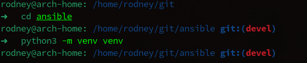

# Домашнее задание к занятию 6 «Создание собственных модулей»

## Выполнил студент группы DevOps-25 Шаповалов Кирилл

<br />

Подготовка к выполнению
-----------------------

    1. Создайте пустой публичный репозиторий в своём любом проекте: my_own_collection.

<a href="https://github.com/nvk-r0dney/my_own_collection">Ссылка на репозиторий</a>

    2. Скачайте репозиторий Ansible: git clone https://github.com/ansible/ansible.git по любому, удобному вам пути.


    3. Зайдите в директорию Ansible: cd ansible.

    4. Создайте виртуальное окружение: python3 -m venv venv.



    5. Активируйте виртуальное окружение: . venv/bin/activate. 
    Дальнейшие действия производятся только в виртуальном окружении.


    6. Установите зависимости pip install -r requirements.txt.


    7. Запустите настройку окружения . hacking/env-setup.


    8. Если все шаги прошли успешно — выйдите из виртуального окружения deactivate.


    9. Ваше окружение настроено. Чтобы запустить его, нужно находиться в директории ansible 
    и выполнить конструкцию . venv/bin/activate && . hacking/env-setup.

<br />

Основная часть
--------------

<br />

Ваша цель — написать собственный module, который вы можете использовать в своей role через playbook. Всё это должно быть собрано в виде collection и отправлено в ваш репозиторий.

<br />

    Шаг 1. В виртуальном окружении создайте новый my_own_module.py файл.


    Шаг 2. Наполните его содержимым или возьмите это наполнение из статьи.

<details><summary>Консоль</summary>

```py
(venv) rodney@arch-home: /home/rodney/git/ansible git:(devel) ✗ 
➜   nano my_own_module.py 
(venv) rodney@arch-home: /home/rodney/git/ansible git:(devel) ✗ 
➜   ls | grep my_own                                                                                         
-rw-r--r--  1 rodney users 4.1K Aug 10 00:14 my_own_module.py
(venv) rodney@arch-home: /home/rodney/git/ansible git:(devel) ✗ 
➜   cat my_own_module.py 
#!/usr/bin/python

# Copyright: (c) 2018, Terry Jones <terry.jones@example.org>
# GNU General Public License v3.0+ (see COPYING or https://www.gnu.org/licenses/gpl-3.0.txt)
from __future__ import (absolute_import, division, print_function)
__metaclass__ = type

DOCUMENTATION = r'''
---
module: my_test

short_description: This is my test module

# If this is part of a collection, you need to use semantic versioning,
# i.e. the version is of the form "2.5.0" and not "2.4".
version_added: "1.0.0"

description: This is my longer description explaining my test module.

options:
    name:
        description: This is the message to send to the test module.
        required: true
        type: str
    new:
        description:
            - Control to demo if the result of this module is changed or not.
            - Parameter description can be a list as well.
        required: false
        type: bool
# Specify this value according to your collection
# in format of namespace.collection.doc_fragment_name
extends_documentation_fragment:
    - my_namespace.my_collection.my_doc_fragment_name

author:
    - Your Name (@yourGitHubHandle)
'''

EXAMPLES = r'''
# Pass in a message
- name: Test with a message
  my_namespace.my_collection.my_test:
    name: hello world

# pass in a message and have changed true
- name: Test with a message and changed output
  my_namespace.my_collection.my_test:
    name: hello world
    new: true

# fail the module
- name: Test failure of the module
  my_namespace.my_collection.my_test:
    name: fail me
'''

RETURN = r'''
# These are examples of possible return values, and in general should use other names for return values.
original_message:
    description: The original name param that was passed in.
    type: str
    returned: always
    sample: 'hello world'
message:
    description: The output message that the test module generates.
    type: str
    returned: always
    sample: 'goodbye'
'''

from ansible.module_utils.basic import AnsibleModule


def run_module():
    # define available arguments/parameters a user can pass to the module
    module_args = dict(
        name=dict(type='str', required=True),
        new=dict(type='bool', required=False, default=False)
    )

    # seed the result dict in the object
    # we primarily care about changed and state
    # changed is if this module effectively modified the target
    # state will include any data that you want your module to pass back
    # for consumption, for example, in a subsequent task
    result = dict(
        changed=False,
        original_message='',
        message=''
    )

    # the AnsibleModule object will be our abstraction working with Ansible
    # this includes instantiation, a couple of common attr would be the
    # args/params passed to the execution, as well as if the module
    # supports check mode
    module = AnsibleModule(
        argument_spec=module_args,
        supports_check_mode=True
    )

    # if the user is working with this module in only check mode we do not
    # want to make any changes to the environment, just return the current
    # state with no modifications
    if module.check_mode:
        module.exit_json(**result)

    # manipulate or modify the state as needed (this is going to be the
    # part where your module will do what it needs to do)
    result['original_message'] = module.params['name']
    result['message'] = 'goodbye'

    # use whatever logic you need to determine whether or not this module
    # made any modifications to your target
    if module.params['new']:
        result['changed'] = True

    # during the execution of the module, if there is an exception or a
    # conditional state that effectively causes a failure, run
    # AnsibleModule.fail_json() to pass in the message and the result
    if module.params['name'] == 'fail me':
        module.fail_json(msg='You requested this to fail', **result)

    # in the event of a successful module execution, you will want to
    # simple AnsibleModule.exit_json(), passing the key/value results
    module.exit_json(**result)


def main():
    run_module()


if __name__ == '__main__':
    main()

(venv) rodney@arch-home: /home/rodney/git/ansible git:(devel) ✗ 

```
</details>

<br />

    Шаг 3. Заполните файл в соответствии с требованиями Ansible так, чтобы он выполнял основную задачу:
    module должен создавать текстовый файл на удалённом хосте по пути, определённом в параметре path, 
    с содержимым, определённым в параметре content.

Объявил параметры модуля:


Описал логику модуля:


В данной логике происходит проверка на наличие заданной директории и если ее нет, она создается. Далее выполняется проверка содержимого файла на наличие в нем заданного контента, и, затем происходит запись контента в файл.

    Шаг 4. Проверьте module на исполняемость локально.

Проверяем модуль на исполнимость. Создал файл `payload.json`:


Запускаем проверку модуля:


Убедимся, что файл создан и в него записан требуемый контент:


    Шаг 5. Напишите single task playbook и используйте module в нём.

Single task playbook в данном случае будет выглядеть так:


    Шаг 6. Проверьте через playbook на идемпотентность.

Тут мне пришлось немного переписать логику модуля, так как не выполнялась проверка на идемпотентность, в целом действие осталось то же самое, но пришлось дописать еще одно условие проверки, и в итоге я все условия обхединил в одно. Стало так:


Запускаем, проверяем.


Playbook полностью идемпотентен.

    Шаг 7. Выйдите из виртуального окружения.


    Шаг 8. Инициализируйте новую collection: ansible-galaxy collection init my_own_namespace.yandex_cloud_elk.


    Шаг 9. В эту collection перенесите свой module в соответствующую директорию.

`my_own_module.py` перенесен в папку **/plugins/modules**

    Шаг 10. Single task playbook преобразуйте в single task role и перенесите в collection. 
    У role должны быть default всех параметров module.

Инициировал новую роль


Параметры модуля задал переменными в каталоге `defaults`, таск будет выглядеть следующим образом:

```yml
---
# tasks file for ./roles/my_own_role

- name: Create test file by module
  my_own_namespase.yandex_cloud_elk.my_own_module:
    path: "{{ default_path }}"
    content: "{{ default_content }}"
```

    Шаг 11. Создайте playbook для использования этой role.

Готовый playbook:

```yml
---
- name: Create test file
  hosts: localhost
  roles:
    - my_own_role
```

    Шаг 12. Заполните всю документацию по collection, выложите в свой репозиторий, 
    поставьте тег 1.0.0 на этот коммит.

Все Readme по роли и коллекции заполнены. На релиз поставлен тег `1.0.0`, релиз выложен в репозиторий на Github - <a href="https://github.com/nvk-r0dney/my_own_collection/tree/1.0.0">ссылка</a>.

    Шаг 13. Создайте .tar.gz этой collection: ansible-galaxy collection build в корневой директории collection.


    Шаг 14. Создайте ещё одну директорию любого наименования, перенесите туда single task 
    playbook и архив c collection.

Создал, перенес.


    Шаг 15. Установите collection из локального архива: ansible-galaxy collection install <archivename>.tar.gz.


    Шаг 16. Запустите playbook, убедитесь, что он работает.

Удалил созданный ранее файл, чтобы playbook заново его создал. Запускаем:


Убедимся, что идемпотентность сохранилась, запускаем playbook еще раз:


    Шаг 17. В ответ необходимо прислать ссылки на collection и tar.gz архив, 
    а также скриншоты выполнения пунктов 4, 6, 15 и 16.

Все скриншоты есть в выполненном ДЗ. Ссылка на репозиторий с новой коллекцией так же в наличии (Шаг 12).